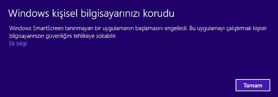
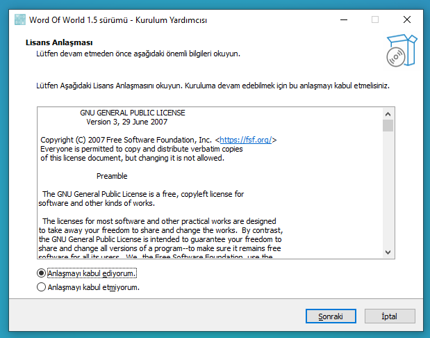
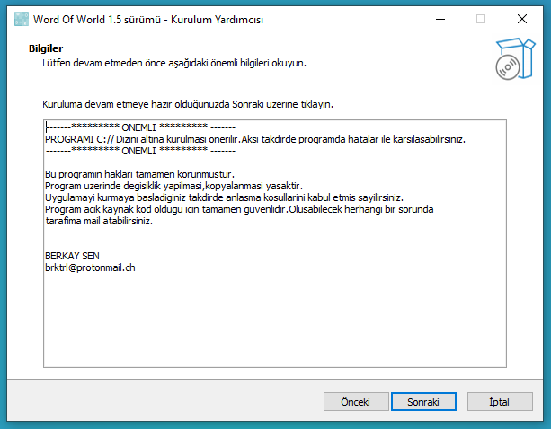
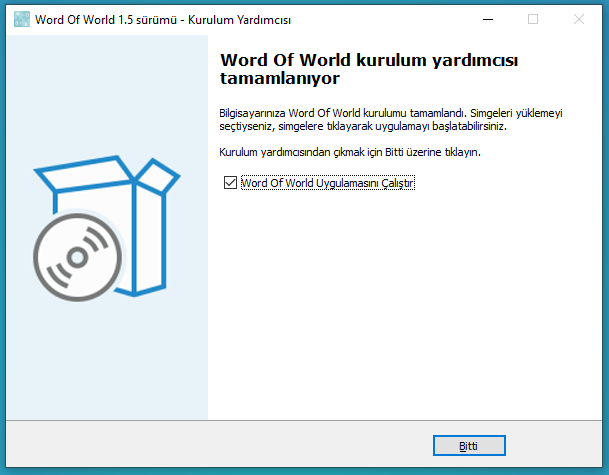
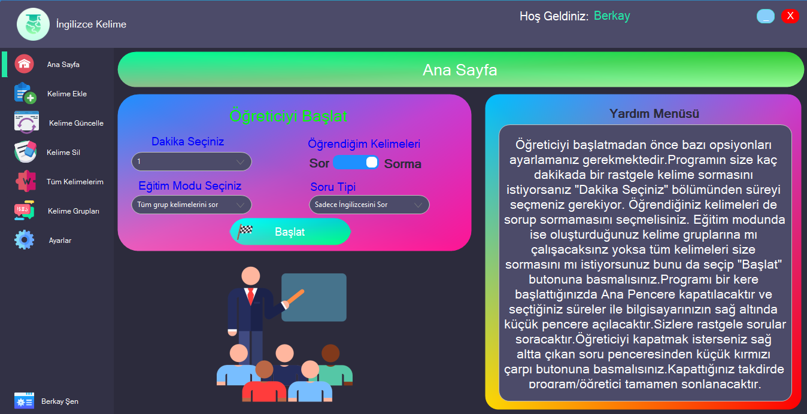
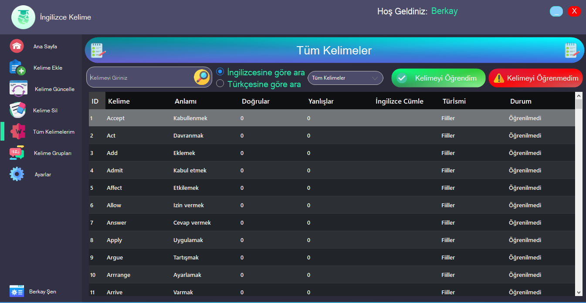
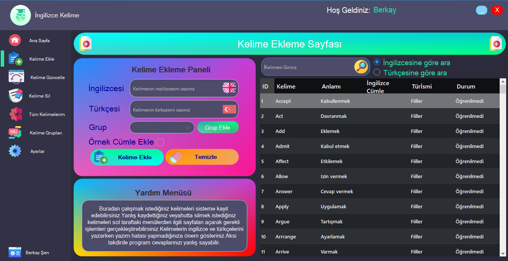
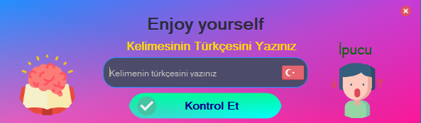
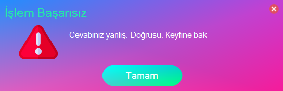

# README

[https://www.notion.so/images/icon.ico](https://www.notion.so/images/icon.ico)

### Word Of World v2.2

İngilizce Kelime Uygulaması 

`<a href="mailto:brktrl@protonmail.ch">Hata Bildir</a>
<br>
<!--<a href="http://www.berkay.rf.gd/" target="_blank">Web Sitesi</a>-->
</div>
</address>
</p>`

[video.mp4](images/video.mp4)

- 

    ## Hakkında

    1. [Program Hakkında](about:blank#Program-Hakk%C4%B1nda)
        - [Ne İle Geliştirildi](about:blank#Ne-%C4%B0le-Geli%C5%9Ftirildi)
    2. [Başlangıç](about:blank#Ba%C5%9Flang%C4%B1%C3%A7)
        - [Kurulum](about:blank#Kurulum)
    3. [Kullanış](about:blank#Kullan%C4%B1m)
    4. [Desteklediği İşletim Sistemleri](about:blank#Destekledi%C4%9Fi-%C4%B0%C5%9Fletim-Sistemleri)
    5. [Örnek Resimler](about:blank#G%C3%B6rseller)
    6. [Lisans](about:blank#lisans)

    ```
    <li><a href="#Iletisim">İletişim</a></li>
    ```

## Program-Hakkında

**WoW, bilgisayar başında uzun vakit geçirirken bir yandan ingilizce kelimeleri öğrenmenizi sağlayan bir uygulamadır.Programda bir çok farklı opsiyon bulunup seçeceğiniz koşullara göre size belirli dakikalarda rastgele kelimeleri sorup bilinçaltınızda öğrenmenizi sağlar.**

```
BrktrLawliet
```

,

```
brktrl@protonmail.ch
```

```
Word Of World
```

### Ne-İle-Geliştirildi

- [C#](https://docs.microsoft.com/en-us/dotnet/csharp/)
- [SQLite](https://www.sqlite.org/index.html)

## Başlangıç

Kurulumda Windows işletim sistemleri için sadece setup dosyasını indirip kurmanız yeterli olacaktır.

### Kurulum

1. Adım `Setup Dosyasını indiriniz.`
2. Adım `Bu tarz bir uyarı ile karşılaşırsanız "Ek Bilgi" butonuna tıklayıp "Yine de Çalıştır" butonuna basınız.`

    

3. Adım `Lisans koşullarını kabul edip "Sonraki" butonuna basınız`

    

4. Adım `Klasik program kurulum dosyası gibi ileri butonuna tıklayarak devam ediniz.` 

    

    

## Kullanım

Kurma işlemini gerçekleştirdikten sonra soldaki tüm sekmelerin içerisinde yardım menülerini okuyup işlemlerinizi yapabilirsiniz.Henüz geliştirme aşamasında olduğu için bug’ları bulunabilir.Lütfen bunları bana bildiriniz.

## Desteklediği-İşletim-Sistemleri

- Windows

## Görseller

Programın arayüzünden örnek görseller.











## lisans Bu yazılım GNU GENERAL PUBLIC Lisansı ile korunmaktadır. Daha fazla bilgi için

```
LICENSE
```

dosyasını okuyunuz.

Copyright (c) 2021

## Iletisim

E-Mail Adresi:E-Mail - brktrl@protonmail.ch

Proje Linki: [https://github.com/Brktrlw/Word-Of-World](https://github.com/Brktrlw/Word-Of-World) Web Site Linki: [http://www.berkay.rf.gd/](http://www.berkay.rf.gd/)